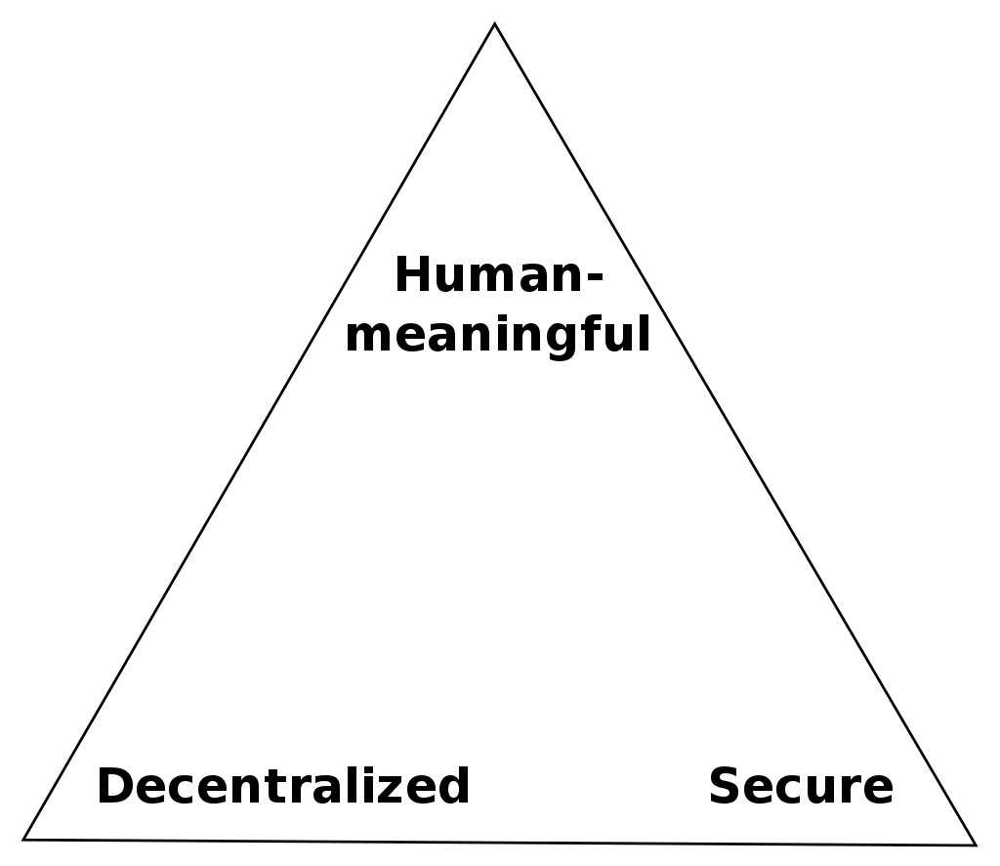
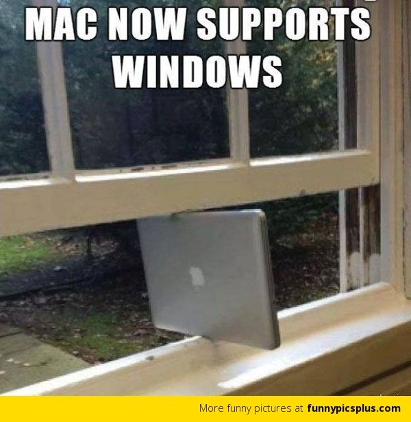
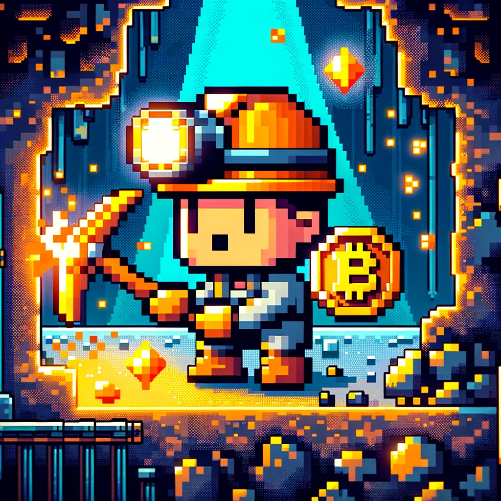

# Where are your coins?

A brief introduction to bitcoin for developers.

Understanding the metaphor of Bitcoin.

---

# About me

- My name is Jason
- I love open source software, bitcoin, and linux
- Contract Programmer since 2019

---

## Pre-requisites

- Bitcoin is a peer-to-peer electronicj cash system
- Let's pretend it's $0 per coin today.
- ~~What is money? Monetary Theory~~
- ~~Macro economics~~
- ~~Energy section conversation~~
- If we have extra time and exhausted technical questions, then we can talk big picture
- Legal disclaimer

---

## Objective

- To see what the underlying technical metaphor of Bitcoin is.
- When talking about bitcoin, we use metaphor to make it more human meaningful.
- (Hidden agenda: Confuse you to incite curiosity)



---

## Metaphors in Computer Science

In computer science, we talk in abstractions for simplicity.

This help us by allowing for additional complexity, but with a tradeoff.

What are some examples of this?



---

```yaml
layout: center
```

## Who has send & receive bitcoin before?

- Can someone describe how I can send them bitcoin step-by-step?
  - Talk in human meaningful ways
- Where are your coins?

---

```yaml
layout: center
```

## Quote from Mastering Bitcoin

"In bitcoin, there are no coins, no senders, no recipients, no balances, no accounts, and no addresses. All those things are constructed at a higher level for the benefit of the user, to make things easier to understand." - Ch 10, Mastering Bitcoin by Andreas Antonopoulos

---

## So, what is cryptocurrency?

- crypto = hidden (Latinized Greek)
- cryptography = writing in secret characters
- cryptocurrency = hidden currency?
- Very little encryption in bitcoin

---

## Core cryptography in bitcoin

- We'll focus on two forms of applied cryptography in bitcoin

- What is a core element of cryptography?

---

## Asymmetry

- Easy to do one way
- Hard to reverse it
- What's an example of this?
  - Non-technical answers are acceptable
- Why is asymmetry important?

---

## Miners = Hashers

- What is a hash?
- What is Proof of Work?
- What is the purpose of mining?
  - Why do we need it?



---

```yaml
layout: center
```

### Quote from Mastering Bitcoin

“The purpose of mining is not the creation of new bitcoin. That’s the incentive system. Mining is the mechanism by which bitcoin’s security is decentralized.” - Mastering Bitcoin

---

## Wallets = Signers

- What are keys?
  - What is a public key?
  - What is a private key?
  - What is a bitcoin address?
- What are signatures?

---

## Wallets = Signers (cont.)

- Fun fact: since private keys are 256 bits, that means there are 2^256 different possibilities.
- "There are as many possible private keys in Bitcoin as there are atoms in a billion galaxies" - Programming Bitcoin by Jimmy Song

[Public key exchange](https://www.youtube.com/watch?v=YEBfamv-_do)

---

## Some demos

- Overly Simplified Python Mining Demo
- ~~How a (modern) bitcoin address is generated~~

---

## Where can you learn more?

- AZ Bitcoiners
  - Started in 2020
  - Meets twice a month
    - one non-tech
    - one tech (Phoenix BitDevs)
- Contact me
  - nostr: @companion
  - Telegram: @not_jason
  - Email: companiontechnology@protonmail.com
  - Discord: @not_jason (find me on the discord)
